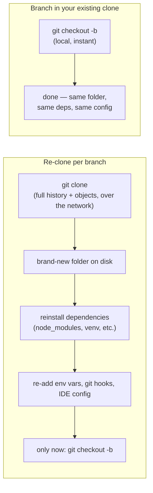

# Creating a Branch — And Why Re-Cloning the Repo Isn't How You Do It

This file answers: *"What are the actual steps to create a branch, and why do some people just re-clone the whole repo every time instead — and why is that the wrong move?"*

## The Steps: Creating a Branch (The Right Way)

1. **Make sure you're on `dev` and it's up to date.**
   ```
   git checkout dev
   git pull origin dev
   ```

2. **Create your new branch off `dev`.**
   ```
   git checkout -b feature/short-description
   ```
   (Newer Git: `git switch -c feature/short-description` does the same thing.)

3. **Push it to the remote so others, and CI, can see it.**
   ```
   git push -u origin feature/short-description
   ```

4. **Work on it, commit, sync with `dev`, open a PR.**
   See [Developer-Workflow.md](./Developer-Workflow.md) for the rest of that cycle.

That's the whole operation. No downloading, no re-fetching history — `git checkout -b` just creates a new pointer in the repository copy you already have. It's local and effectively instant, regardless of how big the repo's history is.

## What "Re-Cloning" Means (and Why People Do It)

Some developers, when asked to "make a new branch for X," instead do this:

```
cd ..
git clone <repo-url> project-feature-x
cd project-feature-x
git checkout -b feature/x
```

That is: download a brand-new full copy of the entire repository into a new folder, just to get a new branch. This habit usually comes from older, centralized version control systems (SVN, for example) where branching really did mean copying a whole directory tree on the server. Git doesn't work that way, but the instinct carries over.

## Why This Is Inefficient



| | Re-clone per branch | Create a branch (`checkout -b`) |
|---|---|---|
| Network | Re-downloads the full repo history, every time | None — you already have it |
| Disk space | A full extra copy per branch (can be gigabytes on a large repo) | A few bytes — just a new pointer |
| Time | Seconds to minutes, scaling with repo size | Instant |
| Local setup | Reinstall dependencies, re-set env vars, re-add git hooks/IDE config, every single clone | None — same working copy, same config |
| Switching branches | `cd` between separate folders | `git checkout other-branch`, in place |
| Uncommitted work | Awkward to move between folders | Stays with you; `git stash` carries it across branches freely |

The core misunderstanding: **a Git branch is not a copy of the repository.** It's a lightweight, movable pointer to a single commit, living inside the same `.git` object database you already downloaded once. Every branch in a repo shares that one object store — that sharing is the entire point of how Git is designed. Re-cloning throws that advantage away and pays the full network, disk, and setup cost again, for a result `git checkout -b` already gives you for free.

## When You Should Actually Re-Clone

Re-cloning isn't *always* wrong — it's wrong specifically as a reaction to "I need a new branch." Legitimate reasons to clone fresh:

- Setting up the repo on a brand-new machine for the first time.
- Your local repo is corrupted and `git fsck` can't recover it.
- You genuinely need two independent working directories open side-by-side at once (e.g. comparing two branches' build output) — and even then, `git worktree` gives you that without a second clone.

## One-Line Summary

**Creating a branch is `git checkout -b` — a free, instant, local operation on a repo you already have. It is not an excuse to `git clone` a brand-new copy of the whole project every time you need one.**

## Sources

See [Sources-And-References.md](./Sources-And-References.md), section 8, for where this comes from — Pro Git's branching chapter and the official `git-clone`/`git-branch`/`git-worktree` docs.
