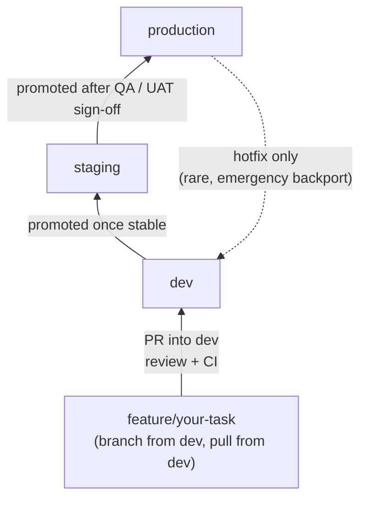

# Developer Workflow: How to Branch and Work on a Feature

This file answers: *"As one developer, what do I actually do, step by step?"*

## Quick Validation of the Common Assumptions

| Claim | Correct? | Why |
|---|---|---|
| "I should branch my feature from `dev`" | ✅ Yes | `dev` is the shared, up-to-date meeting point. Branching from anywhere else risks building on stale or untested code. |
| "I should always pull FROM `dev`" | ✅ Yes | While you're working, keep syncing your feature branch with `dev` so you catch conflicts early, not at the end. |
| "`dev` is always updated FROM production" | ❌ No | It's the other way around: `dev → staging → production`. Code flows forward. `dev` only ever gets updated *from* production in one special case — see "Hotfix Exception" below. |

So: 2 out of 3 right. The flow is a one-way river — don't picture it as a loop.



## Step-by-Step: Working on One Feature

1. **Switch to `dev` and update it.**
   ```
   git checkout dev
   git pull origin dev
   ```
   Never start new work from an old copy of `dev`.

2. **Create your feature branch from `dev`.**
   ```
   git checkout -b feature/short-description-of-task
   ```
   One feature or one fix = one branch. Don't bundle unrelated changes.

3. **Work and commit normally on your feature branch.**
   ```
   git add .
   git commit -m "clear description of the change"
   ```

4. **While you work, regularly pull `dev` back into your branch.**
   This keeps you in sync with everyone else's merged work, so conflicts stay small instead of becoming a huge mess at the end.
   ```
   git checkout dev
   git pull origin dev
   git checkout feature/short-description-of-task
   git merge dev
   ```
   (Some teams use `rebase` instead of `merge` here — ask your lead which your team prefers.)

5. **Push your feature branch and open a Pull Request into `dev`.**
   ```
   git push origin feature/short-description-of-task
   ```
   Then open a PR targeting `dev` in GitHub/GitLab.

6. **Get it reviewed, pass CI, then merge.**
   Once approved and checks pass, the PR is merged into `dev` — never pushed directly.

7. **Delete your feature branch.**
   It's done its job. A clean repo has no stale feature branches hanging around.

## The Hotfix Exception (the only time `dev` gets something "from production")

If `production` breaks and needs an urgent fix:

1. Branch `hotfix/short-description` **from `production`** (not `dev` — `dev` may contain unfinished work you don't want to ship).
2. Fix it, test it, merge it into `production`.
3. **Also merge the same fix into `dev`**, so the next regular release doesn't accidentally undo it.

This is a rare, deliberate backport — not a routine sync. Day-to-day, `dev` is only ever updated by merging in feature branches.

## One-Line Summary

**You always branch off `dev` and pull from `dev` while you work. `dev` never pulls from `production` — `dev` feeds `staging`, which feeds `production`. The only reverse flow is a hotfix, and that's an emergency, not a habit.**

## Sources

See [Sources-And-References.md](./Sources-And-References.md), sections 1, 2, 5, and 6, for where this workflow comes from (Gitflow, PR/CI conventions, and the hotfix back-merge rule).
