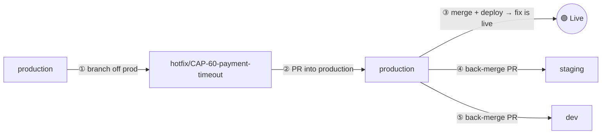

# Hotfix Workflow: Fixing Production Without Breaking the Flow

This file answers: *"Production is broken right now — what do I actually do?"*

## Quick Validation

**Question:** "Hotfix is branched off production, merged back into production, and then this will be pulled by staging and dev?"

**Almost — one important correction:** staging and `dev` do **not** automatically pull the fix. Someone has to **actively merge it back down**, usually with a PR. If nobody does that step, the fix silently disappears the next time `dev` is promoted. This is the single most common hotfix mistake — don't skip it.

## The Flow, Visually



## Step-by-Step

1. **Branch off `production`** — not `dev`.
   ```
   git checkout production
   git pull
   git checkout -b hotfix/CAP-60-payment-timeout
   ```

2. **Fix it, then open a PR into `production`.**
   It still goes through review and CI — just faster than a normal release.

3. **Merge and deploy to `production`.**
   Tag the release, e.g. `v1.2.1`, so it's easy to find later.

4. **Back-merge `production` into `staging`.**
   This is a deliberate PR someone opens — it does not happen by itself.

5. **Back-merge the fix into `dev`.**
   Either `production → dev` or `staging → dev` works, as long as the fix ends up in `dev`. Again, this is a manual step.

## Why Branch From `production` and Not `dev`?

`dev` contains unreleased, half-finished features. If you branched the hotfix from `dev`, you'd accidentally ship those unfinished features to production along with your fix. Branching from `production` means you touch **only** the broken thing — nothing else comes along for the ride.

## Common Mistakes

| Mistake | What happens |
|---|---|
| **Forgetting step 4 or 5** | The next normal release (`dev → staging → production`) overwrites the fix, and the bug comes back. This is the #1 hotfix mistake. |
| **Conflicts during back-merge** | `dev` may have touched the same code since. Resolve it on a branch and get it reviewed — don't force it through. |
| **Turning "hotfix" into "small feature"** | A hotfix should be the *smallest possible* fix for an urgent problem. Anything bigger goes through the normal `feature/* → dev` flow instead. |

## What a Senior Engineer Thinks About

- **Automate the back-merge.** Many teams configure CI to automatically open the `production → dev` PR as soon as a hotfix merges, so no one has to remember to do it manually.
- **Rollback vs. hotfix.** Before writing a fix under pressure, ask: *can I just redeploy the previous working version instead?* That's often faster and safer. You can then write the real, careful fix afterward through the normal flow, without the time pressure.

## Key Takeaway

**A hotfix is: branch from `production` → merge into `production` → merge back into `staging` and `dev`.** That last step — the back-merge — is a deliberate, manual action. It is not automatic, and forgetting it is how fixed bugs come back from the dead.

## Sources

The hotfix branch/back-merge model comes straight from the original Gitflow spec; the rollback advice comes from SRE incident-response practice. See [Sources-And-References.md](./Sources-And-References.md), sections 5 and 7.
