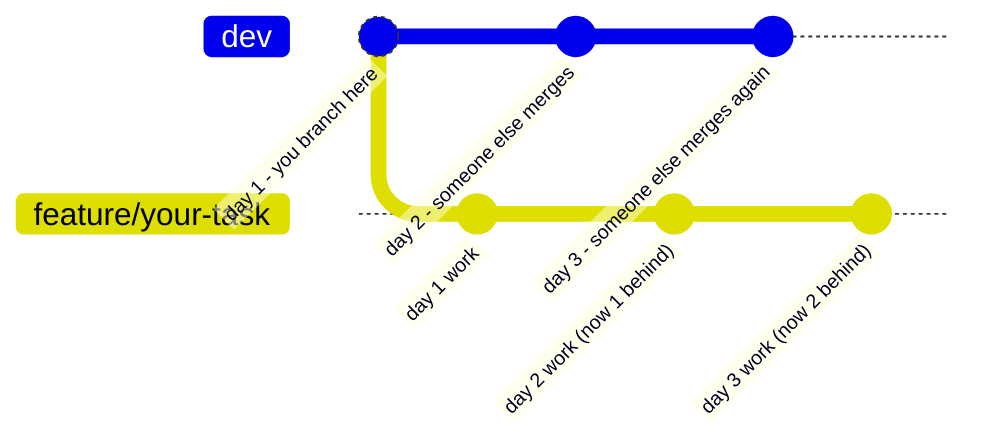

# Pulling From Dev: It's Not a One-Time Thing

This file answers: *"If dev keeps getting updated, does that mean I have to keep pulling from it too?"*

**Yes. Exactly that. This is the single most important habit in this whole workflow, so it gets its own file.**

## The Core Idea

`dev` is not a snapshot you grab once. It is **constantly moving.** Every time anyone on the team merges a PR, `dev` advances one step further. The moment that happens, every open feature branch — including yours — becomes one step more out of date than it was a second ago.



If you never pull, that gap never closes — it only grows. By the time you open your PR, you might be dozens of commits behind, with no idea what changed or whether your code still works against the real, current `dev`.

## So Yes — Pulling Is a Repeated Action, Not a One-Time Step

| What you might think | What's actually true |
|---|---|
| "I pulled from `dev` when I started, I'm covered." | That only covered you for day 1. `dev` has moved since. |
| "I'll pull once, right at the end." | By then the gap may be huge, and conflicts will be bigger and harder to untangle. |
| "Pulling is a one-time setup step, like creating the branch." | No — creating the branch is one-time. Pulling is **ongoing**, for as long as the branch is open. |

**Correct mental model:** pulling from `dev` is not a step in your workflow. It's a habit that runs alongside your workflow, the entire time your branch exists.

## When to Pull (In Practice)

You don't need to pull after literally every single merge anyone makes — that would be disruptive. But you do need to pull:

1. **At the start of each work session** — e.g. once a day, before you start coding.
2. **Before you open your Pull Request** — always, no exceptions, even if you pulled yesterday.
3. **Whenever your branch has been open for more than a day or two without syncing** — the longer it's open, the more it drifts, and the more urgent it is to catch up.
4. **If you hear that someone touched the same files or features you're working on** — pull immediately, don't wait for your usual schedule.

## How

```
git checkout dev
git pull origin dev
git checkout feature/your-task
git merge dev
```

(Some teams prefer `rebase` instead of `merge` — follow whatever convention your team uses, but the *frequency* rule is the same either way.)

## Why This Matters More Than It Seems

- **Small, frequent syncs = small, cheap conflicts.** You catch a conflicting line while it's fresh in everyone's mind.
- **One big sync at the end = large, expensive conflicts.** You're untangling weeks of changes, possibly from people who've since forgotten what they wrote.
- **It's the only way your "finished" code is actually finished** — finished means it works with `dev` as it is *right now*, not as it was when you started.

## One-Line Summary

**`dev` doesn't stop moving just because you stopped pulling — so pulling isn't something you do once, it's something you keep doing for as long as your branch is alive.**

## Sources

Same underlying justification as the previous file — see [Sources-And-References.md](./Sources-And-References.md), section 6.
